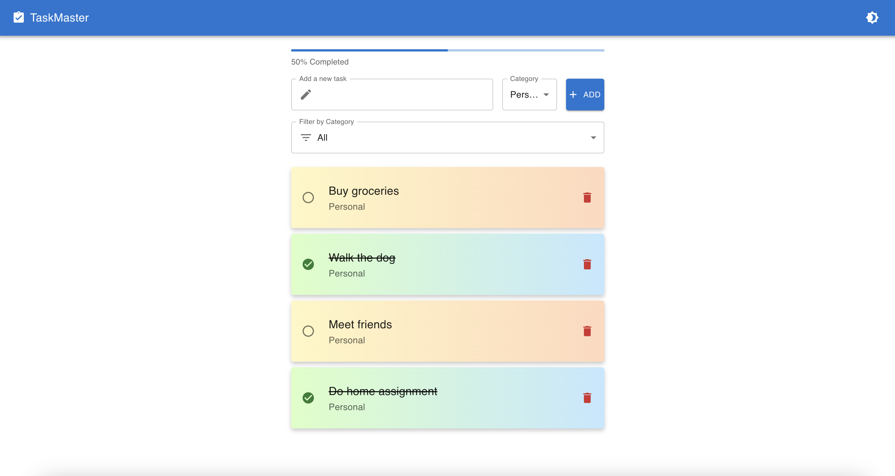
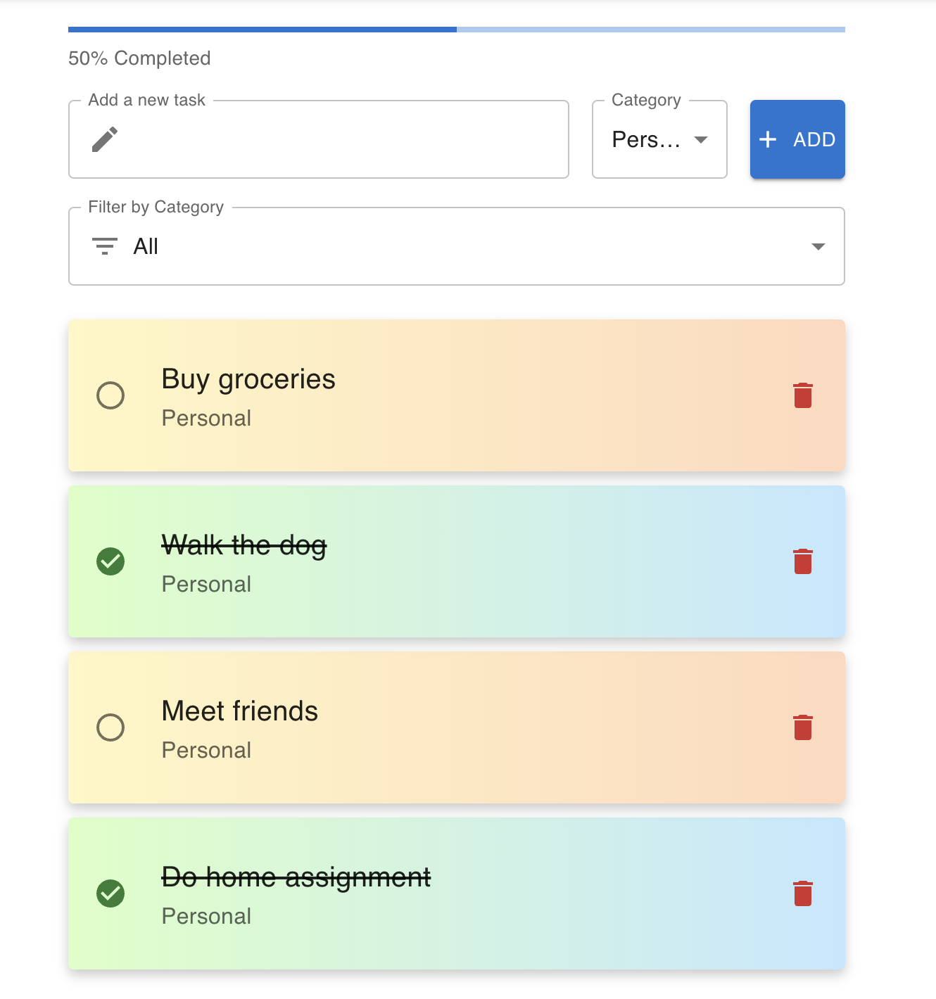
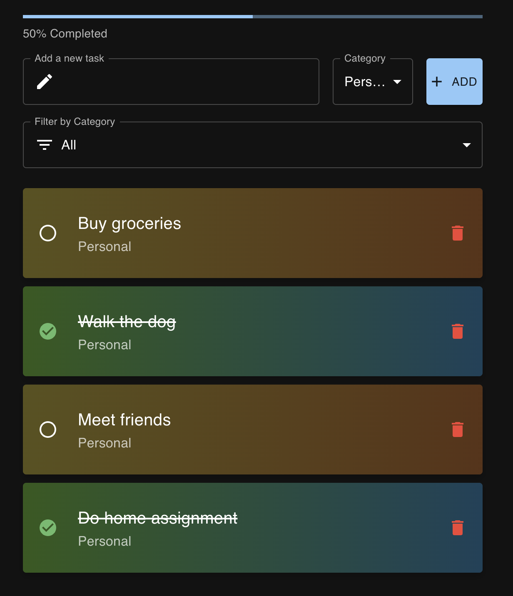

# TaskMaster: The Ultimate ToDo Application 🚀

**TaskMaster** is a modern, intuitive, and fully customizable ToDo application that helps you stay organized and productive. Whether you're managing personal tasks or work-related projects, TaskMaster makes task management easy and enjoyable. With a clean UI, dark mode support, drag-and-drop task sorting, and a progress tracker, TaskMaster brings all the features you need to stay on top of your to-dos.



## ✨ Key Features

- **Drag-and-Drop Task Sorting**: Effortlessly rearrange your tasks with smooth drag-and-drop functionality.
- **Category Filtering**: Filter your tasks by category (Personal, Work, Others) to stay focused.
- **Dark Mode Toggle**: Easily switch between light and dark themes for the best viewing experience.
- **Progress Bar**: Track your progress with a visual progress bar showing completed tasks.
- **Responsive Design**: Works flawlessly on desktop and mobile devices.
- **Persistent Storage**: Tasks are saved locally, so your list is always available even after a page refresh.

## 📸 Screenshots

### Light Mode:


### Dark Mode:


## 🛠️ Technologies Used

- **React**: A JavaScript library for building user interfaces.
- **Material UI**: React components for faster and easier web development.
- **React Beautiful DnD**: Drag-and-drop feature for task management.
- **Local Storage**: Keeps your tasks stored even after you close the browser.

## 🚀 Installation and Setup

1. Clone the repository:
   ```bash
   git clone https://github.com/your-username/taskmaster-todo.git
2. Navigate to the project directory:
   ```bash
   cd taskmaster-todo
3. Install dependencies:
   ```bash
   npm install
4. Start the development server:
   ```bash
   npm start
5. Open the app in your browser at http://localhost:3000.

## 🤝 Contributing

Feel free to contribute to this project! Fork the repository, make your changes, and submit a pull request. All contributions are welcome.

Crafted with 💗 by [Xander Ivanov](https://github.com/aivvanov)